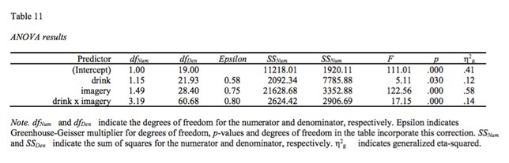

apaTables
================

apaTables 2.0.0

The development version of apaTables R package is hosted here on Github. Current stable version is on the CRAN, see apaTables [here.](https://cran.r-project.org/web/packages/apaTables/index.html)

CRAN apaTables status: 

### Install Stable CRAN Version

``` r
install.packages("apaTables",dep=T)

library(apaTables)
```

### Install Development Version

``` r
install.packages("devtools")

devtools::install_github("dstanley4/apaTables")

library(apaTables)
```

Context
-------

Reproducible research is research for which the numbers reported in the paper can obtained by others using the original data and analysis scripts. (Note that this differs from replicability - the extent to which findings are consistent across samples.) Recent research has revealed a problem with the reproducibility of analyses in many fields. For example, in psychology Nuijten et al. (2015) found that in 50% of articles there was at least once instance of a reported test statistic (e.g., *t*(24)=22.71) being inconsistent with the reported *p*-value. This inconsistency rate suggests there is a major problem with reproducibility in the psychological literature.

My objective in creating the **apaTables** package was to automate the process through which tables are created from analyses when using R. Using **apaTables** ensures that the tables in your manuscript are reproducible.

Although a number of table generation packages exist for R they are typically not useful for psychology researchers because of the need to report results in the style required by the [American Psychological Association](http://www.apa.org); that is, [APA Style](http://www.apastyle.org/products/asc-landing-page.aspx). Consequently, **apaTables** creates [Microsoft Word](https://products.office.com/en-ca/word) documents (.doc files) that contain tables that conform to APA Style.

In many cases it would be necessary to execute additional R commands to obtain all of the statistics needed for an APA Style table. For example, if conducting a regression using the **lm** command the unstandardized regression (i.e., b) weights are reported. Additional commands are needed to obtain standardized (i.e., beta) weights. **apaTables** automatically executes these additional commands to create a table with the required information in Microsoft Word .doc format[1].

Additionally, the [American Statistical Association](http://www.amstat.org) recently released a [position paper](https://www.amstat.org/newsroom/pressreleases/P-ValueStatement.pdf) on the use of *p*-values in research. A component of that statement indicated that "*Scientific conclusions and business or policy decisions should not be based only on whether a p-value passes a specific threshold.*" The Executive Director of the [ASA](http://www.amstat.org) suggested that [confidence intervals should be used to interpret data](http://retractionwatch.com/2016/03/07/were-using-a-common-statistical-test-all-wrong-statisticians-want-to-fix-that/). This statement is consistent with the 1999 [position paper](http://www.apa.org/science/leadership/bsa/statistical/tfsi-followup-report.pdf) from the APA Task Force on Statistical Inference. Consequently, the current version of **apaTables** indicates significance using stars but more importantly reports confidence intervals for the reported effect sizes.

Correlation table
-----------------

Correlation tables can be constructed using the **apa.cor.table** function. The constructed table includes descriptive statistics (i.e., mean and standard deviation) for each variable and a confidence interval for each correlation.

The **apa.cor.table** function creates a correlation table with confidence intervals based on a data frame. The example below creates an APA Style correlation table, see Table 1, using the *attitude* dataset built into *R*.

``` r
library(apaTables)
apa.cor.table(attitude, filename="Table1_APA.doc", table.number=1)
```


Regression table (1 block)
--------------------------

Regression tables can be constructed using the **apa.reg.table** function. The constructed table includes the unstandardized regression coefficient (*b* with CI), standardized regression coefficient (*beta* with CI), semi-partial correlation squared (*s**r*<sup>2</sup> with CI), the correlation (*r*), and the overall fit of the model (indexed by *R*<sup>2</sup> with CI). The *album* sales dataset from Field et al. (2012) is used to illustrate the **apa.reg.table** function (also see the **apa.reg.boot.table** function that works similarily but creates bootstrap confidence intervals).

Basic regression table
----------------------

The **apa.reg.table** function creates a regression table with confidence intervals based on **lm** output; see Table 2.

``` r
library(apaTables)
basic.reg <- lm(sales ~ adverts + airplay, data = album)
apa.reg.table(basic.reg, filename = "Table2_APA.doc", table.number = 2)
```


Blocks regression table
-----------------------

In many cases, it is more useful for psychology researchers to compare the results of two regression models with common variables. This approach is known to many psychology researchers as block-based regression (likely due to the labeling used in popular software packages). Using regression to "control" for certain variables (e.g., demographic or socio-economic variables) is a common use case. In this scenario, the researcher conducts a regression with the "control" variables that is referred to as *block 1*. Following this, the researcher conducts a second regression with the "control" variables and the substantive variables that is referred to as *block 2*. If *block 2* accounts for significant variance in the criterion above and beyond *block 1* then substantive variables are deemed to be meaningful predictors.

A second common use of block-based regression in psychology is testing for continuous-variable interactions. Consider a scenario in which a researcher is testing for an interaction between two continuous variables and two regressions are conducted. The first regression includes the two predictors of interest (*block 1*). The second regression includes the two predictors of interest as well as their product term (*block 2*). If *block 2* accounts for significant variance in the criterion above and beyond *block 1* an interaction is deemed to be present. Admittedly interactions could be tested in a single regression; however, using a block-based regression for this analysis is common in psychology. The example below examines whether advertisements and amount of airplay for a song interact to predict album sales. The resulting table is presented in Table 3. Although this example only uses two blocks, note that any number of blocks can be used with the **apa.reg.table** function. As well, if the predictors in any of the blocks are a product-term, the zero-order correlation will be omitted from the output to prevent interpretation errors common in psychology.

The **apa.reg.table** function allows for multiple (i.e., more 2 or more) blocks as per below; see Table 3.

``` r
library(apaTables)
block1 <- lm(sales ~ adverts + airplay, data = album)
block2 <- lm(sales ~ adverts + airplay + I(adverts*airplay), data = album)
apa.reg.table(block1, block2, filename = "Table3_APA.doc", table.number = 3)
```


1-way ANOVA and d-value tables
------------------------------

There are three functions in apaTables that are helpful for 1-way ANOVA analyses within predictor variables that are independent (**apa.aov.table**, **apa.1way.table**, and **apa.d.table**). All three are illustrated below. First, however, the ANOVA must be conducted - we do so using the *viagra* dataset from Field et al. (2012). When conducting an ANOVA in R using the **lm** command you must ensure your independent variables are R factors and that contrasts are set correctly. Note: repeated measures designs are supported via the **apa.ezANOVA.table** command.

``` r
options(contrasts = c("contr.sum", "contr.poly"))
lm_output <- lm(libido ~ dose, data = viagra)
```

The **apa.aov.table** function creates a 1-way ANOVA table based on lm\_output; see Table 4.

``` r
library(apaTables)
apa.aov.table(lm_output, filename = "Table4_APA.doc", table.number = 4)
```


The **apa.1way.table** function creates a table with the mean and sd for each cell; see Table 5.

``` r
apa.1way.table(iv = dose, dv = libido, data = viagra, 
               filename = "Table5_APA.doc", 
               table.number = 5)
```


The **apa.d.table** function show a d-value (with confidence interval) for each paired comparison; see Table 6.

``` r
apa.d.table(iv = dose, dv = libido, data = viagra, 
            filename = "Table6_APA.doc", 
            table.number = 6)
```


N-way ANOVA tables: 2-way Example
---------------------------------

The 2-way example with independent variable predictors is based on the *goggles* dataset from Field et al. (2012). As before, when conducting an ANOVA in *R* using the **lm** command you must ensure your independent variables are *R* factors and that contrasts are set correctly. Note: repeated measures designs are supported via the **apa.ezANOVA.table** command.

``` r
options(contrasts = c("contr.sum", "contr.poly"))
lm_output <- lm(attractiveness ~ gender*alcohol, data = goggles)
```

The **apa.aov.table** function creates a 2-way ANOVA table based on lm\_output; see Table 7.

``` r
library(apaTables)
apa.aov.table(lm_output, filename = "Table7_APA.doc", table.number = 7)
```


The **apa.2way.table** function creates a table with the mean and sd for each cell; see Table 8. Marginal means can also be requested with the *show.marginal.means* = TRUE. For higher-order designs (i.e., 3-way or higher) use the **filter** command in the *tidyverse* package to select the subset of rows and then use **apa.2way.table** to display cell statistics.

``` r
apa.2way.table(iv1 = gender,iv2 = alcohol, dv = attractiveness, 
               data = goggles, 
               filename = "Table8_APA.doc", 
               show.marginal.means = TRUE,
               table.number = 8)
```


You can use the *tidyverse* package to conducted paired comparisons within each gender again using **apa.d.table**; see Tables 9 and 10.

``` r
library(apaTables)
library(tidyverse)
goggles.men   <- filter(goggles,gender=="Male")
goggles.women <- filter(goggles,gender=="Female")

apa.d.table(iv = alcohol, dv = attractiveness, 
            data = goggles.men, 
            filename = "Table9_APA.doc", 
            table.number = 9)

apa.d.table(iv = alcohol, dv = attractiveness, 
            data = goggles.women, 
            filename = "Table10_APA.doc", 
            table.number = 10)
```


ezANOVA and apaTables: Repeated measures ANOVA
----------------------------------------------

apaTables also supports repeated measures ANOVA tables and repeated measures by between measures (mixed) ANOVA tables via **ezANOVA** output from the *ez* package.

### Repeated Measures: 2-way design

Prior to begining we 'open' the *apaTables*, *tidyverse*, and *ez* packages using the library command as per below.

``` r
library(apaTables)
library(tidyverse)
library(ez)
```

In this example, we used the *drink\_attitude* dataset from Field et al. (2012). As before, this dataset is built into *apaTables* so it does not need to be loaded using **read\_csv** or **read\_sav**. The dataset (*drink\_attitude\_wide*) can be inspected with the **glimpse** command below (this provides information similar to SPSS variable view). We use the "wide" descriptor in the name of the dataset to remind us that the data is in in the "wide" format where one row contains all the data for one person. There are 20 participants so there are 20 rows.

``` r
glimpse(drink_attitude_wide)
```

    ## Observations: 20
    ## Variables: 10
    ## $ participant    <fctr> P1, P2, P3, P4, P5, P6, P7, P8, P9, P10, P11, ...
    ## $ beer_positive  <int> 1, 43, 15, 40, 8, 17, 30, 34, 34, 26, 1, 7, 22,...
    ## $ beer_negative  <int> 6, 30, 15, 30, 12, 17, 21, 23, 20, 27, -19, -18...
    ## $ beer_neutral   <int> 5, 8, 12, 19, 8, 15, 21, 28, 26, 27, -10, 6, 4,...
    ## $ wine_positive  <int> 38, 20, 20, 28, 11, 17, 15, 27, 24, 23, 28, 26,...
    ## $ wine_negative  <int> -5, -12, -15, -4, -2, -6, -2, -7, -10, -15, -13...
    ## $ wine_neutral   <int> 4, 4, 6, 0, 6, 6, 16, 7, 12, 14, 13, 19, 14, 21...
    ## $ water_positive <int> 10, 9, 6, 20, 27, 9, 19, 12, 12, 21, 33, 23, 21...
    ## $ water_negative <int> -14, -10, -16, -10, 5, -6, -20, -12, -9, -6, -2...
    ## $ water_neutral  <int> -2, -13, 1, 2, -5, -13, 3, 2, 4, 0, 9, 5, 0, 4,...

The dataset represents an ANOVA with two repeated measures factors. It is a 3 *drinks* (wine, beer, water) X 3 *imagery* (positive, negative, neutral) design. The dataset uses 10 columns to represent this design. The first column contains a code for each participant (P1, P2, etc.) Note that the *participant* column is a factor as indicated by the &lt; fctr &gt; descriptor. The *participant* column must be a factor which can, as noted previously, be created by the **as\_factor** command.

Each of the remaining 9 columns contain atittude ratings for a single *drink/imagery* combination cell. The naming convention for column names is critical to the workflow we describe below. Each column name represents the level of the *drink* variable separated using an underscore ( \_ ) from a level of the *imagery* variable. For example the first column is called *beer\_positive* representing the cell with a combination of the the *beer* level of *drink* and the positive level of *imagery*. Each value in this column represents *attitude* for a participant in this cell.

In order to conduct a repeated measures ANOVA we need to convert the dataset from the wide format (where each row represents a person) to the long format (where each row represents a single observation from a person). We do this with a series of commands below.

First we rearrange the data so that each row represents a single observation from a person using the **gather** command from the *tidyverse* package. The command creates a new dataset where there is a *participant* column, a *cell* column that indicates the cell an observation came from (e.g., beer\_positive) and an *attitude* column that contains the attitude rating. In this dataset there is one row per observation. Note that in the command below we use, *beer\_positive:water\_neutral* to select all the columns in the dataset between/including beer\_positive to water\_neutral (i.e., all nine columns). The columns must be in a block in the dataset without other variables interspersed between them.

``` r
drink_attitude_long <- gather(data = drink_attitude_wide,
                              key = cell, value = attitude,
                              beer_positive:water_neutral,
                              factor_key=TRUE)
```

In this new long dataset each of the 20 particpants has nine observations (i.e., nine cells) so there are 180 rows. The problem with data resulting from the above command is that the levels of *drink* and *imagery* are combined into a single column called *cell*. That is cell contains the information in the form beer\_positive (i.e., the previous column names for each cell). We can split those levels off into their own columns with the names *drink* and *imagery* and turn those columns into factors with the commands below:

``` r
drink_attitude_long <- separate(data = drink_attitude_long,
                                col = cell, into = c("drink","imagery"),
                                sep = "_", remove = TRUE)

drink_attitude_long$drink <- as_factor(drink_attitude_long$drink)
drink_attitude_long$imagery <- as_factor(drink_attitude_long$imagery)
```

We can inspect the final long version of the dataset with glimpse again:

``` r
glimpse(drink_attitude_long)
```

    ## Observations: 180
    ## Variables: 4
    ## $ participant <fctr> P1, P2, P3, P4, P5, P6, P7, P8, P9, P10, P11, P12...
    ## $ drink       <fctr> beer, beer, beer, beer, beer, beer, beer, beer, b...
    ## $ imagery     <fctr> positive, positive, positive, positive, positive,...
    ## $ attitude    <int> 1, 43, 15, 40, 8, 17, 30, 34, 34, 26, 1, 7, 22, 30...

This output reveals the new data structure. There are now only four columns where each row represents a single observation for a participant. As before, the first column is factor column representing *participant*. But each participant is represented nines times in this column now - because each participant has nine observations (i.e., one in each of the nine cells). Most importantly, we now have a single column indicating level of *drink*, a single column indicating level of *imagery*, and a column indicating the *attitude* rating.

You can see the first few rows in the more familiar format below:

``` r
head(drink_attitude_long)
```

    ## # A tibble: 6 x 4
    ##   participant  drink  imagery attitude
    ##        <fctr> <fctr>   <fctr>    <int>
    ## 1          P1   beer positive        1
    ## 2          P2   beer positive       43
    ## 3          P3   beer positive       15
    ## 4          P4   beer positive       40
    ## 5          P5   beer positive        8
    ## 6          P6   beer positive       17

Prior to conducting the analysis we set the contrasts as per Field et al. (2012).

``` r
alcohol_vs_water <- c(1, 1, -2)
beer_vs_wine <- c(-1, 1, 0)
negative_vs_other <- c(1, -2, 1)
positive_vs_neutral <- c(-1, 0, 1)
contrasts(drink_attitude_long$drink) <- cbind(alcohol_vs_water, beer_vs_wine)
contrasts(drink_attitude_long$imagery) <- cbind(negative_vs_other, positive_vs_neutral)
```

Then we use the **ezANOVA** command from the *ez* package to conduct the repeated measures ANOVA. Be sure to include all of the commands below including the options command which ensures that the output has sufficent number of digits (i.e., numbers after the decimal) for *apaTables*.

``` r
options(digits = 10)
drink_attitude_results <- ezANOVA(data = drink_attitude_long,
                   dv = .(attitude), wid = .(participant),
                   within = .(drink, imagery),
                   type = 3, detailed = TRUE)
```

Now we make the table based on the output:

``` r
apa.ezANOVA.table(drink_attitude_results, 
                  table.number = 11,
                  filename="Table11_APA.doc")
```


### Repeated Measures and Independent Groups: 3-way design

Prior to begining we 'open' the *apaTables*, *tidyverse*, and *ez* packages using the library command as per below.

``` r
library(apaTables)
library(tidyverse)
library(ez)
```

In this example, we used the drink\_attitude dataset from Field et al. (2012). As before, this dataset is built into apaTables. The dataset (*dating\_wide*) can be inspected with the **glimpse** command below (this provides information similar to SPSS variable view). We use the "wide" descriptor in the name of the dataset to remind us that the data is in in the "wide" format where one row contains all the data for one person. There are 20 participants so there are 20 rows.

``` r
glimpse(dating_wide)
```

    ## Observations: 20
    ## Variables: 11
    ## $ participant     <fctr> P01, P02, P03, P04, P05, P06, P07, P08, P09, ...
    ## $ gender          <fctr> Male, Male, Male, Male, Male, Male, Male, Mal...
    ## $ attractive_high <int> 86, 91, 89, 89, 80, 80, 89, 100, 90, 89, 89, 8...
    ## $ average_high    <int> 84, 83, 88, 69, 81, 84, 85, 94, 74, 86, 91, 90...
    ## $ ugly_high       <int> 67, 53, 48, 58, 57, 51, 61, 56, 54, 63, 93, 85...
    ## $ attractive_some <int> 88, 83, 99, 86, 88, 96, 87, 86, 92, 80, 88, 95...
    ## $ average_some    <int> 69, 74, 70, 77, 71, 63, 79, 71, 71, 73, 65, 70...
    ## $ ugly_some       <int> 50, 48, 48, 40, 50, 42, 44, 54, 58, 49, 54, 60...
    ## $ attractive_none <int> 97, 86, 90, 87, 82, 92, 86, 84, 78, 91, 55, 50...
    ## $ average_none    <int> 48, 50, 45, 47, 50, 48, 50, 54, 38, 48, 48, 44...
    ## $ ugly_none       <int> 47, 46, 48, 53, 45, 43, 45, 47, 45, 39, 52, 45...

The dataset represents an ANOVA with one independent groups factor and two repeated measures factors. It is a 2 *gender* (male, female) by 3 *looks* (attrative, average, ugly) X 3 *personality* (high, some, none) design. The dataset uses 11 columns to represent this design. The first column contains a code for each participant (P1, P2, etc.) Note that the *participant* column is a factor as indicated by the "&lt; fctr &gt;" descriptor. The second column is used to indicate the gender of each participant. Both the *participant* and *gender* columns are factors.

Each of the remaining 9 columns contain atittude ratings for a single *looks/personality* combination cell. The naming convention for column names is critical to the workflow we describe below. Each column name represents the level of the *looks* variable separated using an underscore ( \_ ) from a level of the *personality* variable. For example the first column is called *attractive\_high* representing the cell with a combination of the the attractive level of *looks* and the high level of *personality*. Each value in this column represents *date rating* for a participant in this cell.

In order to conduct a mixed between/within ANOVA we need to convert the dataset from the wide format (where each row represents a person) to the long format (where each row represents a single observation from a person) -- taking into account the independent groups factors (*gender*). We do this with a series of commands below.

First we rearrange the data so that each row represents a single observation from a person using the **gather** command from the *tidyverse* package. The command creates a new dataset where there is a *participant* column, a *cell* column that indicates the cell an observation came from (e.g., attractive\_high) and an *date\_rating* column. Note that in the command below we use, *attractive\_high:ugly\_none* to select all the columns in the dataset between/including *attractive\_high* to *ugly\_none* (i.e., all nine columns). The columns must be in a block in the dataset without other variables interspersed between them.

``` r
dating_long <- gather(data = dating_wide,
                     key = cell, value = date_rating,
                     attractive_high:ugly_none,
                     factor_key = TRUE)
```

In this new long dataset each of the 20 particpants hasn nine observations (i.e., nine cells) in addition to their gender classification. As a result, there are 180 rows in the long version of this dataset. The problem with data resulting from the above command is that the levels of *looks* and *personality* are combined into a single column called *cell*. That is cell contains the information in the form beer\_positive (i.e., the previous column names for each cell). We can split those levels off into their own columns with the names "looks" and "personality" and turn those columns into factors with the commands below:

``` r
dating_long <- separate(data = dating_long,
                       col = cell, into = c("looks","personality"),
                       sep = "_", remove = TRUE)

dating_long$looks <- as_factor(dating_long$looks)
dating_long$personality <- as_factor(dating_long$personality)
```

We can inspect the final long version of the dataset with glimpse again:

``` r
glimpse(dating_long)
```

    ## Observations: 180
    ## Variables: 5
    ## $ participant <fctr> P01, P02, P03, P04, P05, P06, P07, P08, P09, P10,...
    ## $ gender      <fctr> Male, Male, Male, Male, Male, Male, Male, Male, M...
    ## $ looks       <fctr> attractive, attractive, attractive, attractive, a...
    ## $ personality <fctr> high, high, high, high, high, high, high, high, h...
    ## $ date_rating <int> 86, 91, 89, 89, 80, 80, 89, 100, 90, 89, 89, 84, 9...

This output reveals the new data structure. There are now only five columns where each row represents a single observation for a participant. As before, the first column is factor column representing *participant*. But each participant is represented nines times in this column now - because each participant has nine observations (i.e., one in each of the nine cells). The second column contains the *gender* factor. The third column indicates the level of *looks*, and the fourth column indicates the level of *personality*. The fith column indicates the *date\_rating*.

You can see the first few rows in the more familiar format below:

``` r
head(dating_long)
```

    ## # A tibble: 6 x 5
    ##   participant gender      looks personality date_rating
    ##        <fctr> <fctr>     <fctr>      <fctr>       <int>
    ## 1         P01   Male attractive        high          86
    ## 2         P02   Male attractive        high          91
    ## 3         P03   Male attractive        high          89
    ## 4         P04   Male attractive        high          89
    ## 5         P05   Male attractive        high          80
    ## 6         P06   Male attractive        high          80

Prior to conducting the analysis we set the contrasts as per Field et al. (2012).

``` r
some_vs_none <- c(1, 1, -2)
hi_vs_av <- c(1, -1, 0)
attractive_vs_ugly <- c(1, 1, -2)
attractive_vs_average <- c(1, -1, 0)
contrasts(dating_long$personality) <- cbind(some_vs_none, hi_vs_av)
contrasts(dating_long$looks) <- cbind(attractive_vs_ugly, attractive_vs_average)
```

Then we use the **ezANOVA** command from the *ez* package to conduct the repeated measures ANOVA. Be sure to include all of the commands below including the options command which ensures that the output has sufficent number of digits (i.e., numbers after the decimal) for apaTables.

``` r
options(digits = 10)
dating_results <-ezANOVA(data = dating_long, 
                         dv = .(date_rating), wid = .(participant),
                        between = .(gender), within = .(looks, personality),
                        type = 3, detailed = TRUE)
```

Now we make the table based on the output:

``` r
dating_table <- apa.ezANOVA.table(dating_results, 
                                  filename = "Table12_APA.doc", 
                                  table.number = 12)
print(dating_table)
```



References
----------

Field, A., Miles, J., Field, Z. *Discovering statistics using R*. Sage: Chicago.

Nuijten, M. B., Hartgerink, C. H. J., van Assen, M. A. L. M., Epskamp, S., & Wicherts, J. M. (2015). The prevalence of statistical reporting errors in psychology (1985-2013). *Behavior Research Methods*. <http://doi.org/10.3758/s13428-015-0664-2>

[1] Technically the tables are in .rtf format. But you should end all files with .doc; this will ensure they are automatically loaded by Microsoft Word
